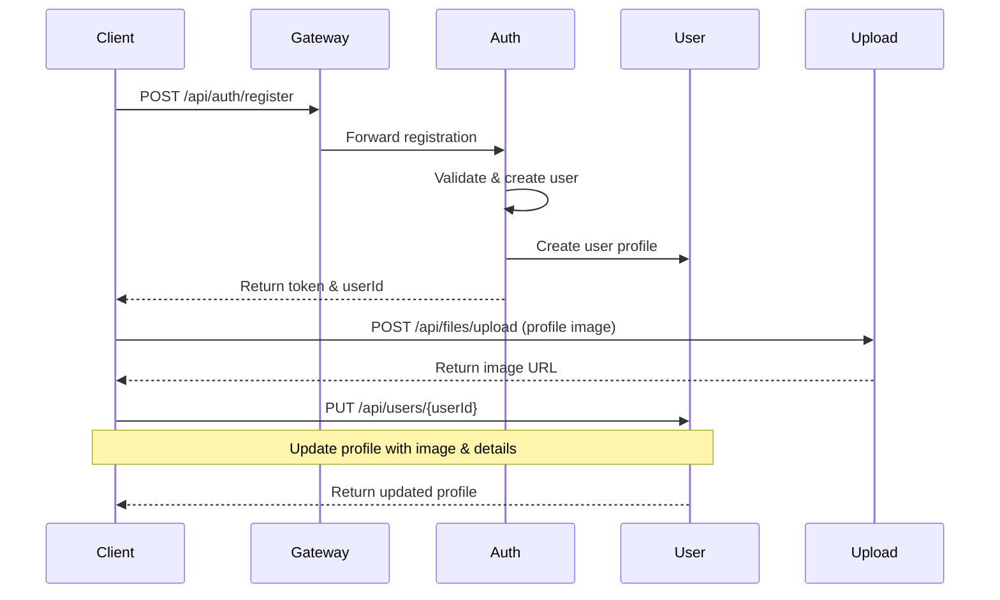
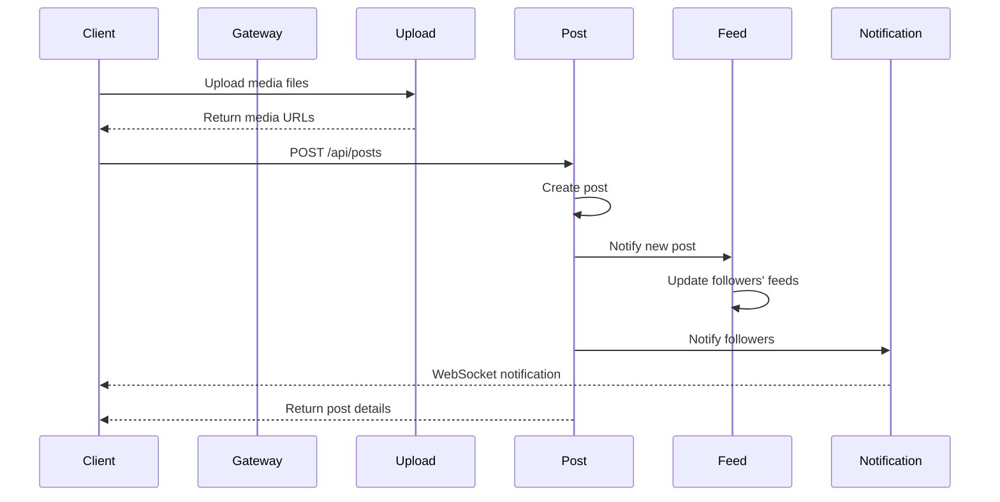
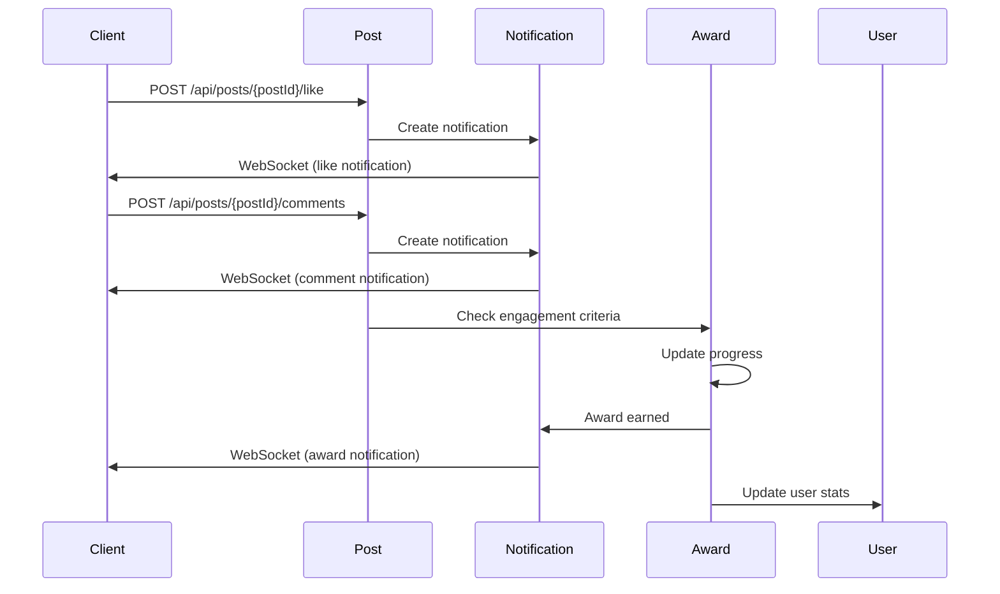
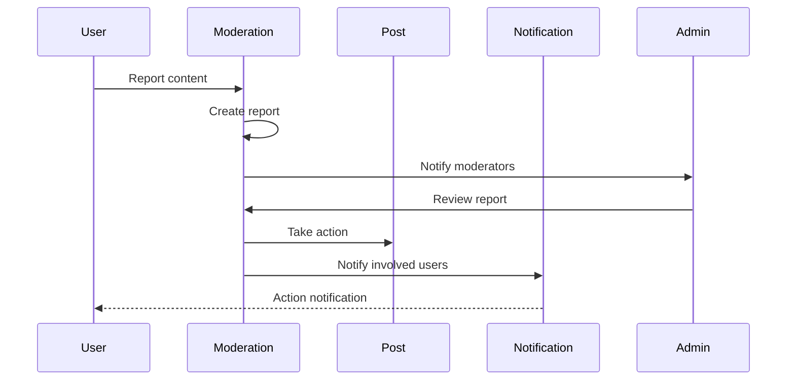

# Microservices API Documentation

## Overview
This document provides comprehensive documentation for frontend developers about the available endpoints, DTOs, and models across all microservices in the system.

## Authentication Service (Port: 8081)
### Models
1. LoginRequest
   ```json
   {
     "email": "string (optional)",
     "username": "string (optional)",
     "password": "string (required)",
     "role": "string (optional)"
   }
   ```
   Note: Either email or username must be provided for login.

2. User (Registration)
   ```json
   {
     "username": "string (required)",
     "email": "string (required)",
     "password": "string (required)",
     "role": "string (optional, defaults to 'USER')"
   }
   ```

### Endpoints
1. Login
   - URLs: `/api/auth/login` or `/login`
   - Method: POST
   - Request Body: LoginRequest object
   - Response:
     ```json
     {
       "token": "string",
       "type": "Bearer",
       "userId": "string"
     }
     ```
   - Error Response (401):
     ```json
     {
       "error": "string"
     }
     ```

2. Register
   - URLs: `/api/auth/register` or `/register`
   - Method: POST
   - Request Body: User object
   - Response: Same as login response (auto-login after registration)
   - Error Response (400):
     ```json
     {
       "error": "string"
     }
     ```

3. Refresh Token
   - URLs: `/api/auth/refresh` or `/refresh`
   - Method: POST
   - Headers:
     ```
     Authorization: Bearer <token>
     ```
   - Response: New token response object
   - Error Response (401):
     ```json
     {
       "error": "string"
     }
     ```

4. Request Password Reset
   - URLs: `/api/auth/password/reset-request` or `/password/reset-request`
   - Method: POST
   - Query Parameters:
     - email: string
   - Response:
     ```json
     {
       "message": "Password reset instructions have been sent to your email"
     }
     ```

5. Reset Password
   - URLs: `/api/auth/password/reset` or `/password/reset`
   - Method: POST
   - Query Parameters:
     - token: string
     - newPassword: string
   - Response:
     ```json
     {
       "message": "Password has been reset successfully"
     }
     ```

### CORS Configuration
The service accepts requests from the following origins:
- http://localhost:3000
- http://localhost:8080
- http://127.0.0.1:3000
- http://localhost
- http://localhost:58138
- http://127.0.0.1:58138
- app://celebrate

### Validation
- Password is required for login
- Email or username must be provided for login
- All validation errors return 400 Bad Request with detailed error messages:
  ```json
  {
    "error": "Validation failed",
    "details": {
      "fieldName": "error message"
    }
  }
  ```

## API Gateway (Port: 8080)
- Acts as the entry point for all frontend requests
- Handles authentication token validation
- Routes requests to appropriate microservices

## User Service
### Models
1. User Profile
   ```json
   {
     "id": "UUID",
     "username": "string",
     "email": "string",
     "fullName": "string",
     "bio": "string",
     "location": "string",
     "profileImageUrl": "string",
     "isPrivate": "boolean",
     "isVerified": "boolean",
     "createdAt": "datetime",
     "updatedAt": "datetime",
     "stats": {
       "postsCount": "number",
       "followersCount": "number",
       "followingCount": "number",
       "updatedAt": "datetime"
     },
     "celebrityProfile": {
       "id": "UUID",
       "stageName": "string",
       "professions": ["string"],
       "majorAchievements": ["string"],
       "notableProjects": ["string"],
       "collaborations": ["string"],
       "netWorth": "string",
       "verifiedAt": "datetime",
       "createdAt": "datetime",
       "updatedAt": "datetime"
     }
   }
   ```

### Endpoints
1. Get User Profile
   - URL: `/api/users/{userId}`
   - Method: GET
   - Authorization: Required
   - Response: User Profile object
   - Error Response (404):
     ```json
     {
       "error": "User not found"
     }
     ```

2. Update User Profile
   - URL: `/api/users/{userId}`
   - Method: PUT
   - Authorization: Required
   - Request Body: User Profile object (partial updates supported)
   - Response: Updated User Profile object
   - Error Response (400):
     ```json
     {
       "error": "Validation failed",
       "details": {
         "fieldName": "error message"
       }
     }
     ```

3. Get User Stats
   - URL: `/api/users/{userId}/stats`
   - Method: GET
   - Authorization: Required
   - Response:
     ```json
     {
       "postsCount": "number",
       "followersCount": "number",
       "followingCount": "number",
       "updatedAt": "datetime"
     }
     ```

4. Get Celebrity Profile
   - URL: `/api/users/{userId}/celebrity`
   - Method: GET
   - Authorization: Required
   - Response: Celebrity Profile object or 404 if not a celebrity

5. Follow User
   - URL: `/api/users/{userId}/follow`
   - Method: POST
   - Authorization: Required
   - Response:
     ```json
     {
       "success": true,
       "message": "Now following user"
     }
     ```

6. Unfollow User
   - URL: `/api/users/{userId}/unfollow`
   - Method: POST
   - Authorization: Required
   - Response:
     ```json
     {
       "success": true,
       "message": "Unfollowed user"
     }
     ```

7. Get Followers
   - URL: `/api/users/{userId}/followers`
   - Method: GET
   - Authorization: Required
   - Query Parameters:
     - page: number
     - size: number
   - Response: Paginated list of User Profile objects

8. Get Following
   - URL: `/api/users/{userId}/following`
   - Method: GET
   - Authorization: Required
   - Query Parameters:
     - page: number
     - size: number
   - Response: Paginated list of User Profile objects

### Notes
- All endpoints require authentication except public profile views
- Profile images are handled through the File Upload service
- Celebrity verification is managed by the Moderation service
- User stats are automatically updated by respective services (Posts, Followers, etc.)
- Private profiles only show limited information to non-followers

## Post Service
### Models
1. Post
   ```json
   {
     "id": "number",
     "userId": "number",
     "title": "string",
     "content": "string",
     "celebrationType": "enum (see CelebrationType)",
     "mediaUrls": ["string"],
     "createdAt": "datetime",
     "updatedAt": "datetime",
     "status": "enum (DRAFT|PUBLISHED|ARCHIVED)",
     "likesCount": "number",
     "commentsCount": "number"
   }
   ```

2. Comment
   ```json
   {
     "id": "number",
     "postId": "number",
     "userId": "number",
     "content": "string",
     "createdAt": "datetime",
     "updatedAt": "datetime"
   }
   ```

3. CelebrationType (Enum)
   ```json
   [
     "PERSONAL_ACHIEVEMENT",
     "CAREER_MILESTONE",
     "EDUCATIONAL_SUCCESS",
     "HEALTH_FITNESS",
     "RELATIONSHIP_MILESTONE",
     "CREATIVE_ACCOMPLISHMENT",
     "BUSINESS_SUCCESS",
     "COMMUNITY_SERVICE",
     "TRAVEL_ADVENTURE",
     "LIFE_EVENT",
     "OTHER"
   ]
   ```

### Endpoints
1. Create Post
   - URL: `/api/posts`
   - Method: POST
   - Authorization: Required
   - Request Body: Post object (without id, likesCount, commentsCount)
   - Response: Created Post object

2. Get Posts
   - URL: `/api/posts`
   - Method: GET
   - Query Parameters:
     - page: number
     - size: number
     - userId: number (optional)
     - celebrationType: string (optional)
   - Response: Paginated list of Post objects

3. Get Post by ID
   - URL: `/api/posts/{postId}`
   - Method: GET
   - Response: Post object
   - Error Response (404):
     ```json
     {
       "error": "Post not found"
     }
     ```

4. Update Post
   - URL: `/api/posts/{postId}`
   - Method: PUT
   - Authorization: Required (must be post owner)
   - Request Body: Post object
   - Response: Updated Post object

5. Delete Post
   - URL: `/api/posts/{postId}`
   - Method: DELETE
   - Authorization: Required (must be post owner)
   - Response: 
     ```json
     {
       "message": "Post deleted successfully"
     }
     ```

6. Add Comment
   - URL: `/api/posts/{postId}/comments`
   - Method: POST
   - Authorization: Required
   - Request Body: 
     ```json
     {
       "content": "string"
     }
     ```
   - Response: Created Comment object

7. Get Comments
   - URL: `/api/posts/{postId}/comments`
   - Method: GET
   - Query Parameters:
     - page: number
     - size: number
   - Response: Paginated list of Comment objects

8. Like Post
   - URL: `/api/posts/{postId}/like`
   - Method: POST
   - Authorization: Required
   - Response:
     ```json
     {
       "success": true,
       "likesCount": "number"
     }
     ```

9. Unlike Post
   - URL: `/api/posts/{postId}/unlike`
   - Method: POST
   - Authorization: Required
   - Response:
     ```json
     {
       "success": true,
       "likesCount": "number"
     }
     ```

### Notes
- Posts can have multiple media attachments (images/videos)
- Media files are handled through the File Upload service
- Posts can be drafted before publishing
- Posts can be moderated through the Moderation service
- Comments support basic text formatting
- Real-time updates for likes and comments are handled through WebSocket connections

## Search Service
### Endpoints
1. Search Users
   - URL: `/api/search/users`
   - Method: GET
   - Query Parameters:
     - query: string
     - page: number
     - size: number

2. Search Posts
   - URL: `/api/search/posts`
   - Method: GET
   - Query Parameters:
     - query: string
     - page: number
     - size: number

## News Feed Service
### Models
1. FeedItem
   ```json
   {
     "id": "string",
     "type": "POST|SHARE|COMMENT",
     "content": "Object",
     "timestamp": "datetime"
   }
   ```

### Endpoints
1. Get User Feed
   - URL: `/api/feed`
   - Method: GET
   - Authorization: Required
   - Query Parameters:
     - page: number
     - size: number

## Messaging Service
### Models
1. Message
   ```json
   {
     "id": "number",
     "chatId": "number",
     "senderId": "number",
     "receiverId": "number",
     "content": "string",
     "read": "boolean",
     "createdAt": "datetime",
     "mediaUrl": "string"
   }
   ```

2. Chat
   ```json
   {
     "id": "number",
     "user1Id": "number",
     "user2Id": "number",
     "createdAt": "datetime",
     "lastMessageAt": "datetime",
     "active": "boolean"
   }
   ```

### Endpoints
1. Create Chat
   - URL: `/api/chats`
   - Method: POST
   - Authorization: Required
   - Request Body:
     ```json
     {
       "userId": "number"  // The user to start chat with
     }
     ```
   - Response: Chat object

2. Get User Chats
   - URL: `/api/chats`
   - Method: GET
   - Authorization: Required
   - Query Parameters:
     - page: number
     - size: number
   - Response: Paginated list of Chat objects with last message

3. Get Chat Messages
   - URL: `/api/chats/{chatId}/messages`
   - Method: GET
   - Authorization: Required
   - Query Parameters:
     - page: number
     - size: number
   - Response: Paginated list of Message objects

4. Send Message
   - URL: `/api/chats/{chatId}/messages`
   - Method: POST
   - Authorization: Required
   - Request Body:
     ```json
     {
       "content": "string",
       "mediaUrl": "string (optional)"
     }
     ```
   - Response: Message object

5. Mark Messages as Read
   - URL: `/api/chats/{chatId}/messages/read`
   - Method: POST
   - Authorization: Required
   - Response:
     ```json
     {
       "success": true,
       "unreadCount": "number"
     }
     ```

6. Get Unread Count
   - URL: `/api/messages/unread/count`
   - Method: GET
   - Authorization: Required
   - Response:
     ```json
     {
       "unreadCount": "number"
     }
     ```

### WebSocket Endpoints
1. Chat Updates
   - URL: `ws://localhost:8080/ws/chat`
   - Events:
     - `MESSAGE_RECEIVED`: New message received
     - `MESSAGE_READ`: Messages marked as read
     - `CHAT_CREATED`: New chat created
     - `USER_TYPING`: User is typing

### Notes
- Messages support text and media content
- Media files are handled through the File Upload service
- Real-time updates are handled through WebSocket connections
- Messages are stored permanently unless deleted by users
- Chats can be deactivated but not deleted
- Supports typing indicators and read receipts

## Notification Service
### Models
1. Notification
   ```json
   {
     "id": "number",
     "userId": "string",
     "message": "string",
     "type": "string",
     "read": "boolean",
     "createdAt": "datetime"
   }
   ```

### Endpoints
1. Get User Notifications
   - URL: `/api/notifications`
   - Method: GET
   - Authorization: Required
   - Query Parameters:
     - page: number
     - size: number
     - read: boolean (optional)
   - Response: Paginated list of Notification objects

2. Mark Notification as Read
   - URL: `/api/notifications/{notificationId}/read`
   - Method: POST
   - Authorization: Required
   - Response:
     ```json
     {
       "success": true,
       "unreadCount": "number"
     }
     ```

3. Mark All Notifications as Read
   - URL: `/api/notifications/read-all`
   - Method: POST
   - Authorization: Required
   - Response:
     ```json
     {
       "success": true,
       "unreadCount": 0
     }
     ```

4. Get Unread Count
   - URL: `/api/notifications/unread/count`
   - Method: GET
   - Authorization: Required
   - Response:
     ```json
     {
       "unreadCount": "number"
     }
     ```

### WebSocket Endpoints
1. Real-time Notifications
   - URL: `ws://localhost:8080/ws/notifications`
   - Events:
     - `NOTIFICATION_RECEIVED`: New notification received
     - `NOTIFICATION_READ`: Notification marked as read
     - `ALL_READ`: All notifications marked as read

### Notes
- Notifications are generated for various events:
  - New followers
  - Post likes and comments
  - Mentions and tags
  - Achievement unlocks
  - System announcements
- Notifications can be customized through user preferences
- Supports push notifications through Firebase Cloud Messaging
- Notifications are retained for 30 days by default

## Rating & Review Service
### Models
1. Rating
   ```json
   {
     "id": "number",
     "userId": "number",
     "postId": "number",
     "ratingValue": "number (1-5)",
     "createdAt": "datetime",
     "updatedAt": "datetime"
   }
   ```

2. Review
   ```json
   {
     "id": "number",
     "userId": "number",
     "postId": "number",
     "content": "string (min 10 chars)",
     "status": "ACTIVE|HIDDEN|DELETED|REPORTED|UNDER_REVIEW",
     "likesCount": "number",
     "createdAt": "datetime",
     "updatedAt": "datetime"
   }
   ```

### Endpoints
1. Submit Rating
   - URL: `/api/ratings`
   - Method: POST
   - Authorization: Required
   - Request Body:
     ```json
     {
       "postId": "number",
       "ratingValue": "number (1-5)"
     }
     ```
   - Response: Rating object

2. Get Post Ratings
   - URL: `/api/posts/{postId}/ratings`
   - Method: GET
   - Query Parameters:
     - page: number
     - size: number
   - Response: Paginated list of Rating objects

3. Submit Review
   - URL: `/api/reviews`
   - Method: POST
   - Authorization: Required
   - Request Body:
     ```json
     {
       "postId": "number",
       "content": "string"
     }
     ```
   - Response: Review object
   - Error Response (400):
     ```json
     {
       "error": "Validation failed",
       "details": {
         "content": "Review content must be at least 10 characters"
       }
     }
     ```

4. Get Post Reviews
   - URL: `/api/posts/{postId}/reviews`
   - Method: GET
   - Query Parameters:
     - page: number
     - size: number
     - status: string (optional)
   - Response: Paginated list of Review objects

5. Like Review
   - URL: `/api/reviews/{reviewId}/like`
   - Method: POST
   - Authorization: Required
   - Response:
     ```json
     {
       "success": true,
       "likesCount": "number"
     }
     ```

6. Unlike Review
   - URL: `/api/reviews/{reviewId}/unlike`
   - Method: POST
   - Authorization: Required
   - Response:
     ```json
     {
       "success": true,
       "likesCount": "number"
     }
     ```

7. Update Review Status
   - URL: `/api/reviews/{reviewId}/status`
   - Method: PUT
   - Authorization: Required (Admin only)
   - Request Body:
     ```json
     {
       "status": "ACTIVE|HIDDEN|DELETED|REPORTED|UNDER_REVIEW"
     }
     ```
   - Response: Updated Review object

### Notes
- Users can only rate a post once
- Ratings must be between 1 and 5
- Reviews must be at least 10 characters long
- Reviews can be moderated through status changes
- Review likes are tracked separately from post likes
- Reviews can be reported for moderation
- Aggregate ratings are cached for performance

## Moderation Service
### Models
1. Report
   ```json
   {
     "id": "number",
     "reporterId": "number",
     "targetId": "number",
     "targetType": "POST|USER|COMMENT|REVIEW",
     "reason": "string",
     "description": "string",
     "status": "PENDING|UNDER_REVIEW|RESOLVED|DISMISSED",
     "moderatorId": "number",
     "resolution": "string",
     "createdAt": "datetime",
     "updatedAt": "datetime"
   }
   ```

2. ModeratorAction
   ```json
   {
     "id": "number",
     "moderatorId": "number",
     "reportId": "number",
     "action": "WARN|HIDE|DELETE|BAN|DISMISS",
     "note": "string",
     "createdAt": "datetime"
   }
   ```

### Endpoints
1. Submit Report
   - URL: `/api/moderation/reports`
   - Method: POST
   - Authorization: Required
   - Request Body:
     ```json
     {
       "targetId": "number",
       "targetType": "POST|USER|COMMENT|REVIEW",
       "reason": "string",
       "description": "string"
     }
     ```
   - Response: Report object

2. Get Reports
   - URL: `/api/moderation/reports`
   - Method: GET
   - Authorization: Required (Moderators only)
   - Query Parameters:
     - page: number
     - size: number
     - status: string
     - targetType: string
   - Response: Paginated list of Report objects

3. Update Report Status
   - URL: `/api/moderation/reports/{reportId}`
   - Method: PUT
   - Authorization: Required (Moderators only)
   - Request Body:
     ```json
     {
       "status": "PENDING|UNDER_REVIEW|RESOLVED|DISMISSED",
       "resolution": "string"
     }
     ```
   - Response: Updated Report object

4. Take Moderation Action
   - URL: `/api/moderation/actions`
   - Method: POST
   - Authorization: Required (Moderators only)
   - Request Body:
     ```json
     {
       "reportId": "number",
       "action": "WARN|HIDE|DELETE|BAN|DISMISS",
       "note": "string"
     }
     ```
   - Response: ModeratorAction object

### Notes
- All moderation actions are logged for accountability
- Reports can be escalated to senior moderators
- Automated content filtering is applied before human moderation
- Multiple reports on same target are grouped
- Appeals process is available for moderated content

## Awards Service
### Models
1. Award
   ```json
   {
     "id": "number",
     "name": "string",
     "description": "string",
     "category": "ACHIEVEMENT|ENGAGEMENT|MILESTONE|SPECIAL",
     "imageUrl": "string",
     "points": "number",
     "criteria": {
       "type": "string",
       "conditions": ["string"],
       "threshold": "number"
     },
     "createdAt": "datetime",
     "updatedAt": "datetime"
   }
   ```

2. UserAward
   ```json
   {
     "id": "number",
     "userId": "number",
     "awardId": "number",
     "earnedAt": "datetime",
     "progress": "number",
     "completed": "boolean",
     "displayOnProfile": "boolean"
   }
   ```

### Endpoints
1. Get Available Awards
   - URL: `/api/awards`
   - Method: GET
   - Query Parameters:
     - category: string
     - page: number
     - size: number
   - Response: Paginated list of Award objects

2. Get User Awards
   - URL: `/api/users/{userId}/awards`
   - Method: GET
   - Authorization: Required
   - Query Parameters:
     - completed: boolean
     - category: string
   - Response: List of UserAward objects

3. Get Award Progress
   - URL: `/api/users/{userId}/awards/{awardId}/progress`
   - Method: GET
   - Authorization: Required
   - Response:
     ```json
     {
       "awardId": "number",
       "currentProgress": "number",
       "threshold": "number",
       "percentage": "number"
     }
     ```

4. Toggle Award Display
   - URL: `/api/users/awards/{userAwardId}/display`
   - Method: PUT
   - Authorization: Required
   - Request Body:
     ```json
     {
       "displayOnProfile": "boolean"
     }
     ```
   - Response: Updated UserAward object

### Notes
- Awards are automatically granted when criteria are met
- Progress is tracked in real-time
- Some awards are time-limited or seasonal
- Special awards can be manually granted by administrators
- Awards contribute to user reputation score
- Users can choose which awards to display on their profile

## General Notes for Frontend Developers

### Authentication
- All authenticated requests should include the Bearer token in the Authorization header:
  ```
  Authorization: Bearer <token>
  ```
- Token is obtained from the login endpoint
- Token expiration is handled by the API Gateway

### Error Handling
Common error responses:
```json
{
  "status": "number",
  "message": "string",
  "timestamp": "datetime",
  "path": "string"
}
```

### Pagination
For endpoints that support pagination:
- Default page size: 20
- Response format:
  ```json
  {
    "content": [],
    "totalElements": "number",
    "totalPages": "number",
    "size": "number",
    "number": "number"
  }
  ```

### WebSocket Connections
For real-time features:
- Notifications: `ws://localhost:8080/ws/notifications`
- Messages: `ws://localhost:8080/ws/messages`
- Feed updates: `ws://localhost:8080/ws/feed`

### File Upload
For services that handle file uploads:
- Maximum file size: 10MB
- Supported formats: jpg, jpeg, png, gif
- Upload endpoint: `/api/files/upload`
- Response includes the file URL for future reference

### Rate Limiting
- API Gateway implements rate limiting
- Default: 100 requests per minute per user
- Excess requests will receive 429 Too Many Requests response

### Monitoring
Health check endpoints available for all services:
- `/actuator/health`
- `/actuator/info`

## Common Use Cases and Flows

### 1. User Registration and Profile Setup


#### Implementation Steps:
1. Register user:
   ```json
   POST /api/auth/register
   {
     "email": "user@example.com",
     "password": "securepass",
     "username": "newuser",
     "fullName": "New User"
   }
   ```

2. Upload profile image:
   ```json
   POST /api/files/upload
   Content-Type: multipart/form-data
   file: (binary)
   ```

3. Update profile:
   ```json
   PUT /api/users/{userId}
   {
     "bio": "Hello world!",
     "location": "New York",
     "profileImageUrl": "https://..."
   }
   ```

### 2. Creating and Sharing a Celebration Post


#### Implementation Steps:
1. Upload media:
   ```json
   POST /api/files/upload
   Content-Type: multipart/form-data
   files: (binary)
   ```

2. Create post:
   ```json
   POST /api/posts
   {
     "title": "Graduated!",
     "content": "Just got my degree!",
     "celebrationType": "EDUCATIONAL_SUCCESS",
     "mediaUrls": ["https://..."]
   }
   ```

### 3. User Interaction Flow (Like, Comment, Award)


#### Implementation Steps:
1. Like post:
   ```json
   POST /api/posts/{postId}/like
   ```

2. Add comment:
   ```json
   POST /api/posts/{postId}/comments
   {
     "content": "Congratulations!"
   }
   ```

### 4. Content Moderation Flow


#### Implementation Steps:
1. Report content:
   ```json
   POST /api/moderation/reports
   {
     "targetId": "123",
     "targetType": "POST",
     "reason": "INAPPROPRIATE",
     "description": "Contains offensive content"
   }
   ```

2. Moderator action:
   ```json
   POST /api/moderation/actions
   {
     "reportId": "456",
     "action": "HIDE",
     "note": "Violates community guidelines"
   }
   ```

## Service Interactions

### Authentication Flow
- Gateway → Auth Service: Token validation
- Auth Service → User Service: User details
- All Services → Gateway: Token verification

### Post Creation Flow
1. Post Service:
   - Validates user permissions
   - Creates post record
   - Triggers events

2. Feed Service:
   - Receives post creation event
   - Updates relevant user feeds
   - Applies feed algorithms

3. Notification Service:
   - Notifies followers
   - Handles user mentions
   - Manages notification preferences

4. Search Service:
   - Indexes new post content
   - Updates search rankings

### Award System Integration
1. Services that trigger awards:
   - Post Service: Content creation awards
   - User Service: Profile completion awards
   - Rating Service: Received ratings awards
   - Moderation Service: Good behavior awards

2. Award Service:
   - Tracks progress across services
   - Manages award criteria
   - Issues achievements

### Real-time Updates
1. WebSocket Connections:
   - Connected through API Gateway
   - Authenticated using same JWT
   - Maintains user presence

2. Event Types:
   - Post interactions (likes, comments)
   - Chat messages
   - Notifications
   - Feed updates
   - Award progress

### Caching Strategy
1. User Service:
   - Profile data: 5 minutes
   - Preferences: 1 hour
   - Stats: 1 minute

2. Post Service:
   - Post content: 1 hour
   - Like counts: 1 minute
   - Comment counts: 1 minute

3. Feed Service:
   - Feed items: 5 minutes
   - Trending posts: 1 minute

### Error Handling and Recovery
1. Circuit Breaker Patterns:
   - Service timeouts: 5 seconds
   - Retry attempts: 3
   - Fallback behaviors defined

2. Data Consistency:
   - Event sourcing for critical flows
   - Eventual consistency for feeds
   - Real-time sync for messages

### Performance Considerations
1. Rate Limiting:
   - API Gateway: 100 requests/minute
   - File Upload: 10 uploads/minute
   - WebSocket: 100 messages/minute

2. Pagination:
   - Default page size: 20
   - Max page size: 100
   - Cursor-based for large datasets

3. Caching:
   - Redis for real-time data
   - CDN for media files
   - Local caching for configurations

---

Note: The sequence diagrams above use Mermaid.js syntax and can be rendered in compatible Markdown viewers or documentation tools.